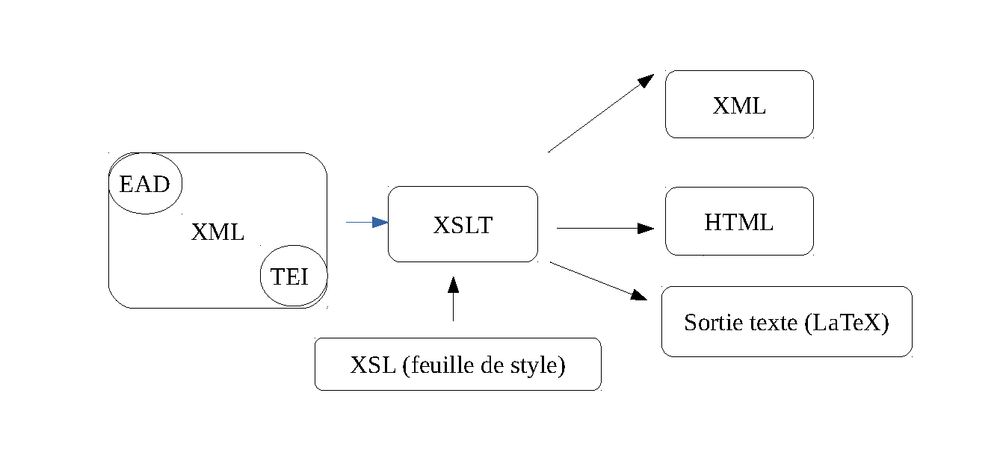
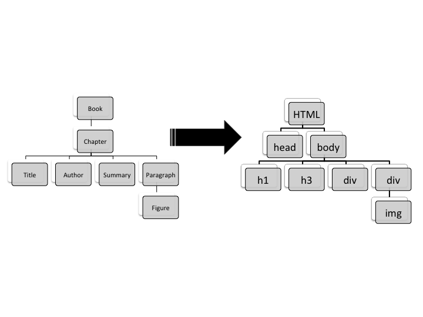
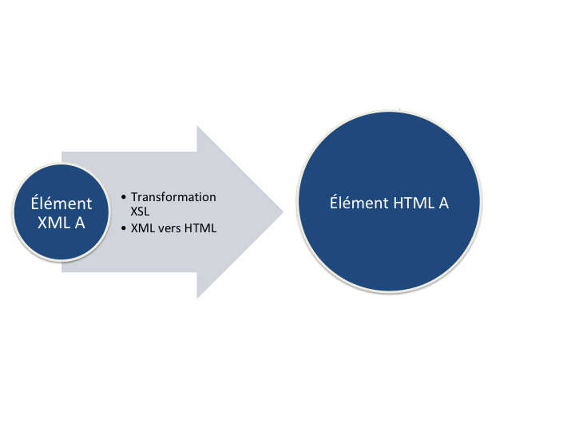
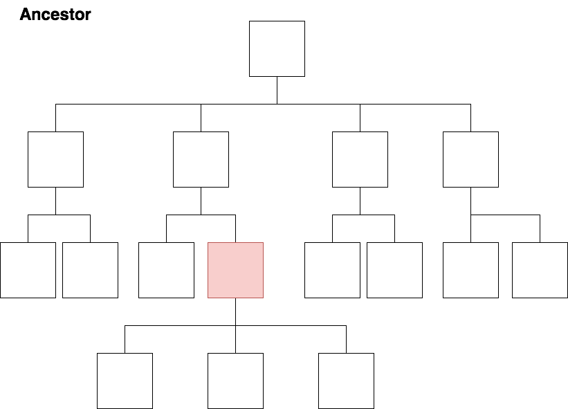
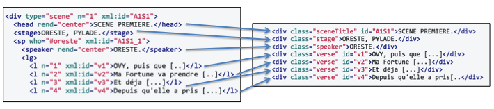
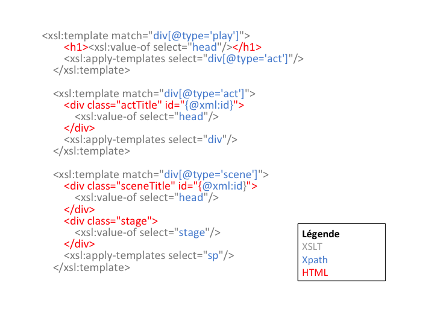

# XPath and XSLT basis

Ariane Pinche
Warsaw, May 20–24, 201
 
---
# 1. XML environment 




---
## 1.1 XML and XSLT

**XSLT** (Extensible Stylesheet Language Transformations) is a functional programming language used to specify how an XML document should be transformed into another document that can, but is not necessarily, another XML document.

An XSLT processor reads an XML input tree and an XSL style sheet and outputs a result tree. "

Elliotte Rusty Harold, W. Scott Means, Philippe Ensarguet [et al.], *XML en concentré*, Paris, O’Reilly, 2005, p. 519.

---



---



---

# 2.XPath


* Xpath 2.0 is published by the *World Wide Web Consortium* (W3C) and is part of the family of XML standards;

* Xpath is a query language that allows you to browse an XML tree;

* Xpath was designed as an integrated language, not an autonomous language;

* **Warning**: Xpath is a "read-only" language.

<br/>

To go further : Michael R. Kay, *XPath 2.0 programmer’s reference*, Indianapolis, IN, Wrox Press, 2004. pp. 1-5.

---

## 2.1. XPath syntax

- Xpath allows to express a path to an element of a tree.

- A path expression corresponds to a sequence of steps separated by the operator "/".

	- *TEI/text/body/div/head*	

**Without specific indication, the relationship is from a parent element to a child element.**

###### To go further :
Michael R. Kay, *XPath 2.0 programmer’s reference*, Indianapolis, IN, Wrox Press, 2004, pp. 215-216.


---
###### Exercices

---
## 2.3. The main Xpath axes

- *child axis*: selects elements and texts of child nodes
	- TEI/teiHeader
	
- *descendant axis*: selects the direct or indirect descendant nodes of an element
	- body // div
- *parent axis*: selects the parent element of an element
	- div / parent :: body
- *ancestor axis* : selects all direct or indirect parent elements back to the root element
	- p / ancestor :: body
- *attribute axis*: selects the attribute of an element
	- div / @ type
---
###### Exercices

---



---


---

## 2.3- Xpath

To refine its Xpath query, you can add **predicates**.
The predicate is written in square brackets after the element to which it refers.
- On peut ainsi spécifier la position d'un élément :
	- `p[1]`;
- Une propriété de l'élément :
	- `said[@xml:id="roman"]` 
---
#### Exercices 

In the XML file of the *Sacramenta*

- Select  the name of the author of the text;
- Select all the speeches in the text;
- Select all the Karolus speeches in the text;
- Select the first quote in the text;
- Select all the occurrences of Ludivicus name in the text.
- Select all the speeches or the quotation in German.

---
# 3. XSLT
---

## 3.1 Transformation XSLT to HTML



---

## 3.2 XSLT Syntax 


---
## 3.2.1 Initiating an XSL file

- open the xml file
- open a new xsl file
- the file contains the following lines
`<xsl:stylesheet`       `xmlns:xsl="http://www.w3.org/1999/XSL/Transform"`
`xmlns:xs="http://www.w3.org/2001/XMLSchema"`
`exclude-result-prefixes="xs" version="2.0">` 
[...]
`</xsl:stylesheet>`

---
## 3.2.2 Observing (1)

1) Write and apply the following rule :
```XML
<xsl:template match="/">
    <xsl:apply-templates/>
</xsl:template> 
```
2) Select and copy the text of an XML element
```XML
<xsl:template match="said">
  <p><xsl:value-of select="."/></p>
</xsl:template>
```
3) Parse the complete tree, select only '<said>', put all child text between tags
 ```XML
<xsl:template match="/">
  <p><xsl:value-of select="//tei:said"/></p>
</xsl:template>
```

---

## 3.2.2 Observing (2)

4) Parse the tree, only apply the rules for said elements, englobe each `<said>` between tags
```XML 
<xsl:template match="/">
 <xsl:apply-templates select="//tei:said"/>
</xsl:template>
<xsl:template match="tei:said">
       <p><xsl:value-of select="."/></p>
</xsl:template>
```
---
## 3.2.3 How to set up an xsl template ?


- Create a template with  : 
```XML
<xsl:template>
  ```

- Add the match attribute to select an XML element  
```XML
<xsl:template match="my_XML_elementl">
  ```
---
- You can add text :
```XML
<xsl:template match="said">
    there was a speech
</xsl:template>
  ```
- You can add tags
```XML
<xsl:template match="said">
  <p>
      <xsl:value-of select="."/>
  </p>
</xsl:template>

```
NB: XSLT *value-of* function retrieve the textual content of a tag.

---
## 3.3 Principles of the XSLT language

- « By default, an XSLT processor reads the XML input from top to bottom, starting at the root and descending element in the tree in the order in which elements appear. Model rules are activated in the order of meeting elements.This means that a model rule for an parent element will be activated before the model rules corresponding to its sub-elements. »

Elliotte Rusty Harold, W. Scott Means, Philippe Ensarguet [et al.], *XML en concentré*, Paris, O’Reilly, 2005, p. 164.

---

- **XSLT is an XML language**, it has the same logic. XSLT rule applies to the selected element and its children. If you want the rules written for a child element to apply, you must allow the application by adding the XSLT *apply-templates* function in the parent element rule.
```XML
<xsl:template match="div[@type='section']">
  <div>Section 
  	<xsl:value-of select="@n"/>
  </div>
	<xsl:apply-templates/>
</xsl:template>
````

---

## Exercice : Transform an XML file into HTML

### Step 1 : Set up the HTML structure

- Set up a minimal HTML structure (head, body)
- Add in the `<head>` a `<title>` and add in it as text the value of *titleStmt/title*
- Add in the body title `<h1>`with the value : *titleStmt/title*
- Add in the body title `<h2>`with the value : *titleStmt/author*
- Add in the body `<div>` to display the complete text of the *Sacramenta*
- Place correctly the *apply-templates*
---

### Step 2 : adding templates to display normalised text

- Write a template to only display normalised text;

- Add indications about the foliation.

---
### Step 3 : make an index 

- Make a list of all the names in the person list;
- Count the number of occurrences in the text;
- Make the list of the occurrences in the text.
